Syncthing Desktop is an application for macOs that gives you a user friendly and beatiful app for controlling a [Syncthing](https://syncthing.net/) instance.

It is build with Electron and web technologies while trying to keep it as performant as possible.

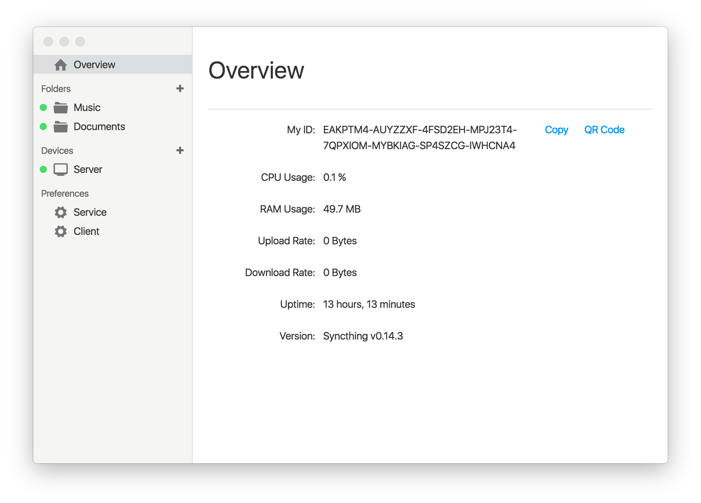

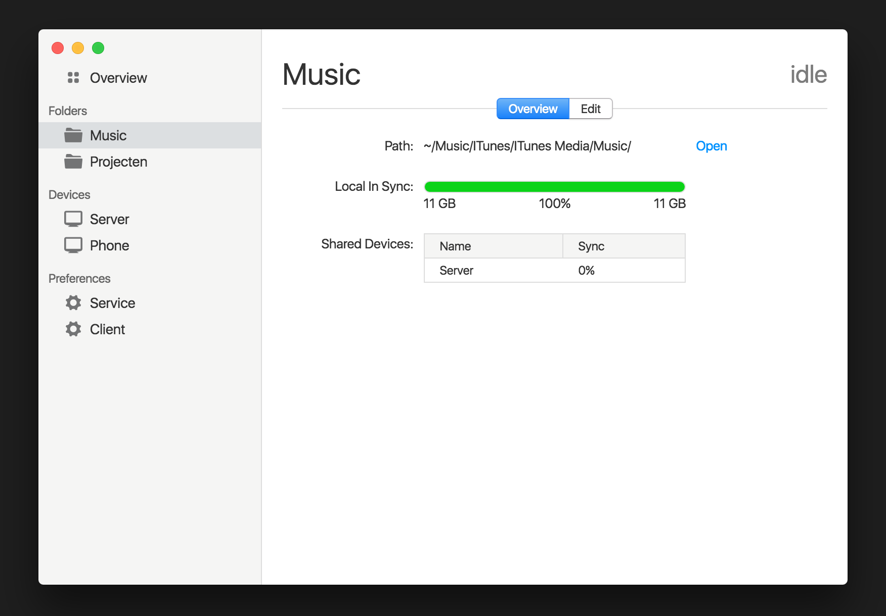

If there are unsynchronized files you can see  

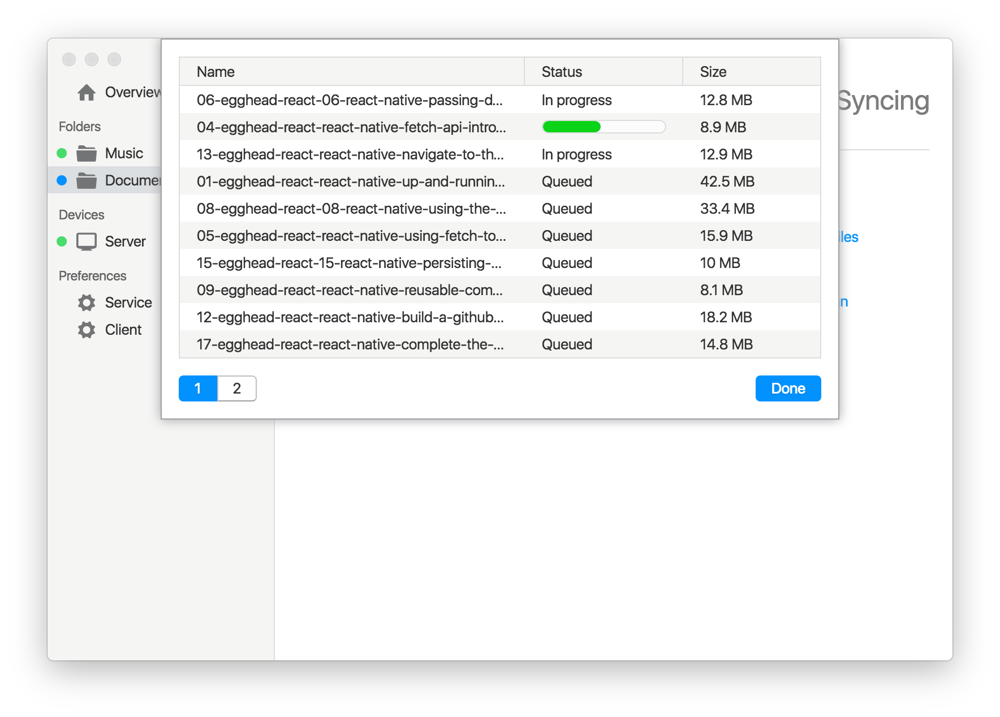

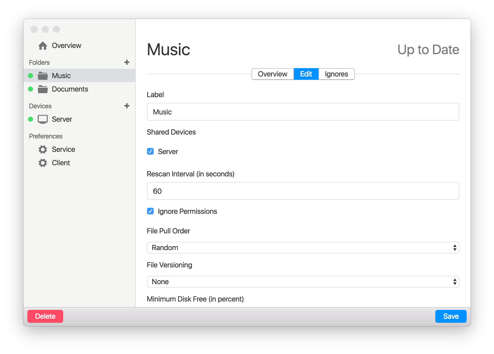

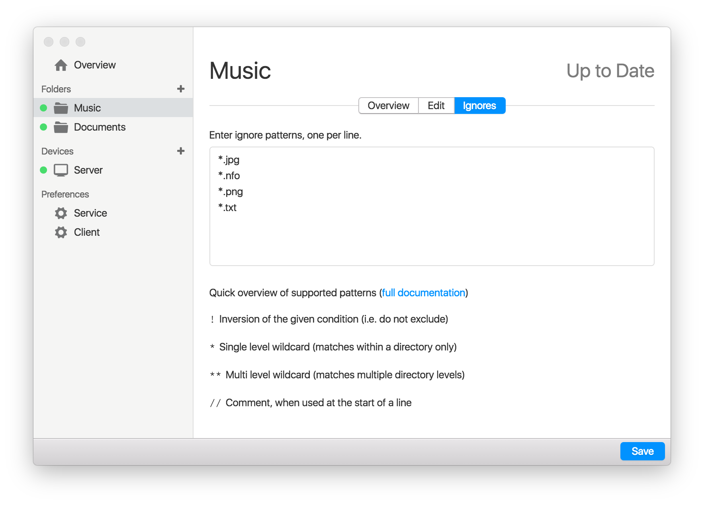

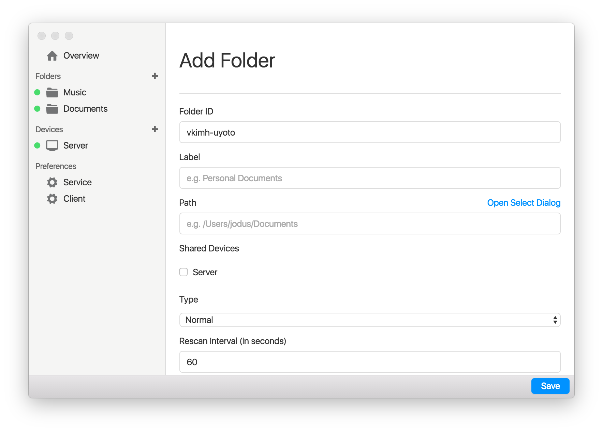

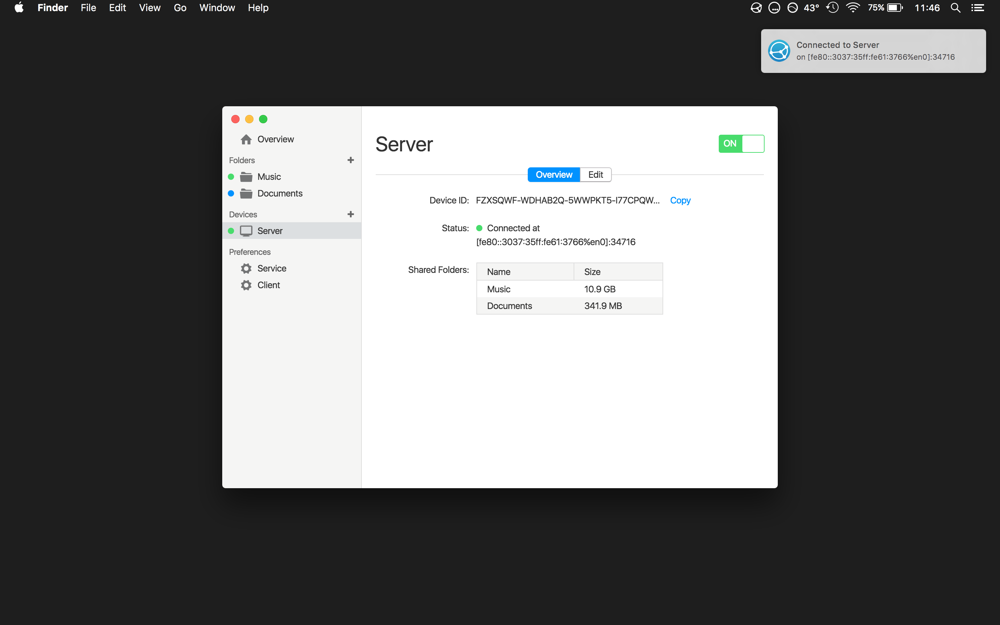

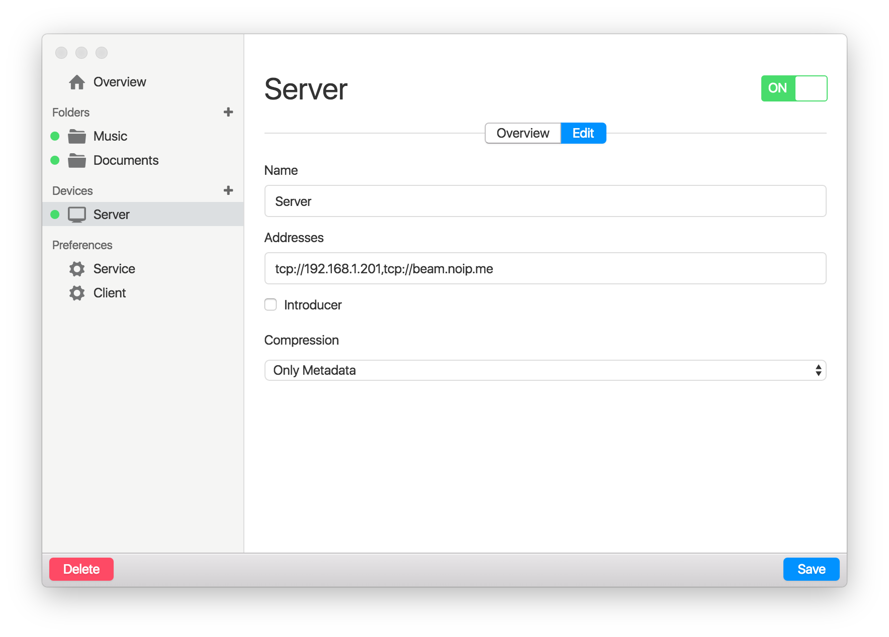

Adding a device is easy. Just paste or type the device ID and choose a name. If you have the QR-Code of the device you can scan it from the webcam.

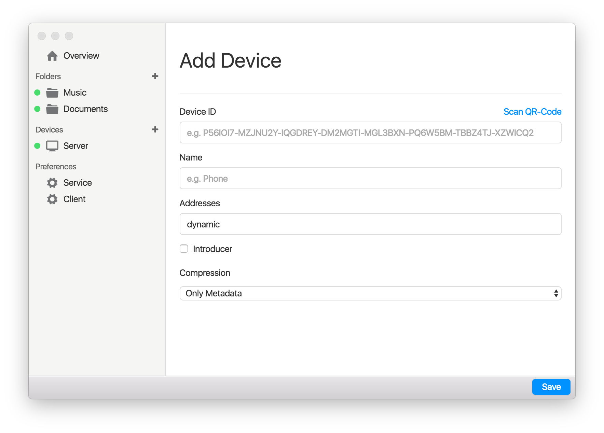

A tray icon and menu with basic information will remain open even when the window is closed (notifications will also still be pushed).

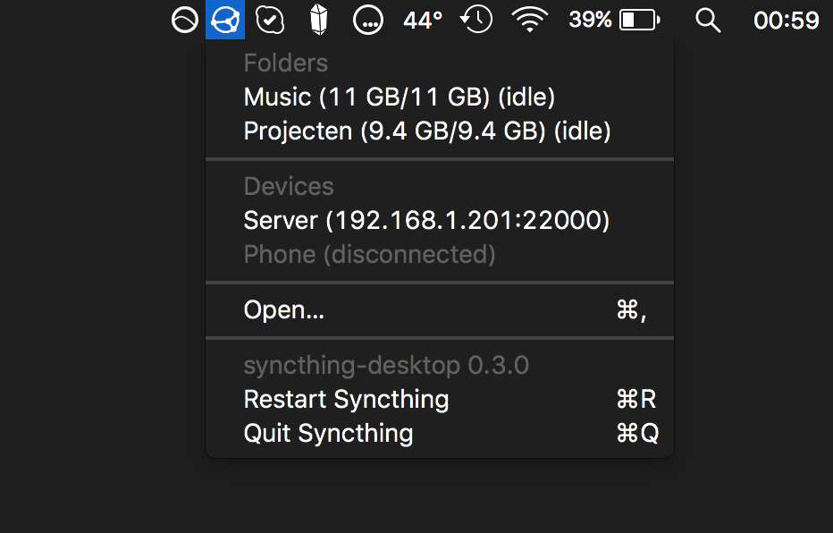

When the app is opened for the first time it will search for local Syncthing instances if none are found you can always enter it manually.

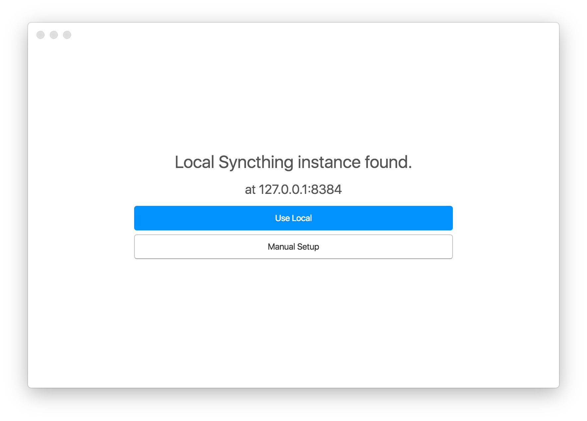

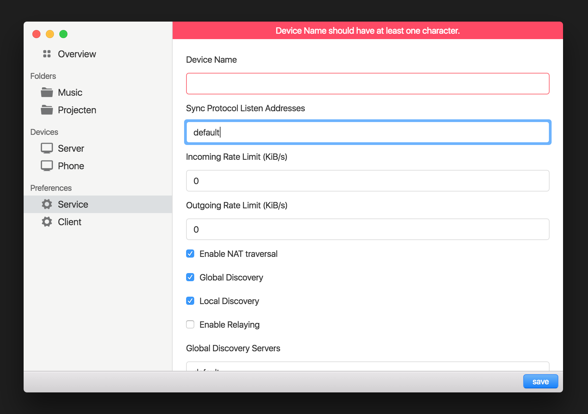